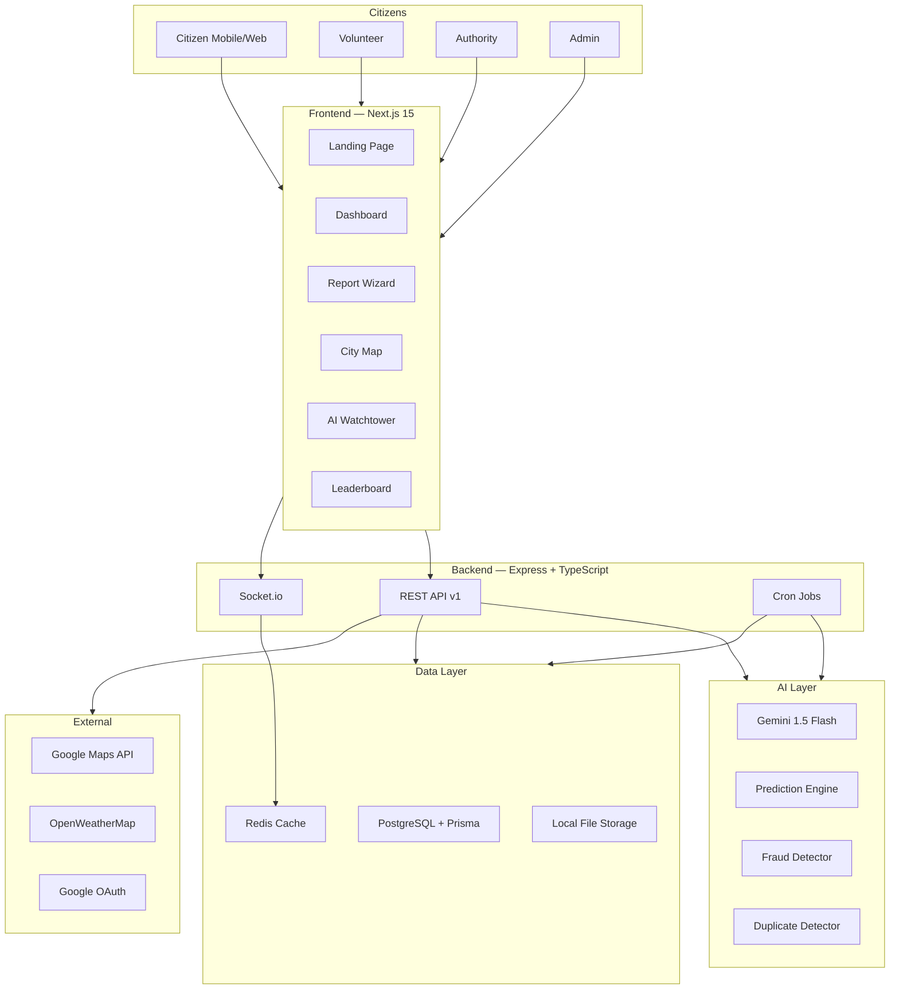

# Community Hero AI — System Architecture

## Overview

Community Hero AI is a distributed, event-driven civic intelligence platform built on a microservice-ready monorepo architecture.

## System Flow



## Component Details

### Frontend (Next.js 15 App Router)

| Layer | Technology | Purpose |
|---|---|---|
| Routing | App Router | File-based routing, layouts, streaming |
| State | Zustand | Global auth, UI, notification state |
| Server State | TanStack Query | API data caching, optimistic updates |
| Realtime | Socket.io-client | Live notifications, status updates |
| Styling | Tailwind CSS | Utility-first responsive design |
| Animations | Framer Motion | Micro-interactions, page transitions |
| Forms | React Hook Form + Zod | Validated form handling |
| Auth | NextAuth v5 | Google OAuth + credentials |

### Backend (Express + TypeScript)

| Layer | Technology | Purpose |
|---|---|---|
| HTTP | Express.js | REST API server |
| Realtime | Socket.io | WebSocket management |
| ORM | Prisma | Type-safe database queries |
| Cache | ioredis | Session caching, rate limiting |
| Auth | JWT + Passport | Stateless authentication |
| Validation | Zod + express-validator | Input sanitization |
| Logging | Winston | Structured logging |
| Jobs | node-cron | Scheduled tasks |

### AI Services (Gemini)

```
Issue Media Uploaded
         │
         ▼
┌─────────────────────┐
│  Gemini Vision API  │◄── Base64 image/video frame
│  gemini-1.5-flash   │
└─────────────────────┘
         │
         ▼
┌─────────────────────────────────────────────┐
│  Structured Output (JSON)                    │
│  {                                           │
│    issueType: "POTHOLE",                     │
│    severity: "HIGH",                         │
│    confidence: 0.87,                         │
│    publicRisk: "HIGH",                       │
│    department: "Roads & Infrastructure",     │
│    estimatedResolutionTime: "72 hours",      │
│    estimatedCost: "₹15,000-25,000",          │
│    reasoning: "...",                         │
│    tags: ["road", "traffic", "school-zone"]  │
│  }                                           │
└─────────────────────────────────────────────┘
```

### Civic Emergency Score Algorithm

```
Score = (Severity × 0.4) + (Votes × 0.2) + (Verification × 0.2) + (Proximity × 0.2)

Severity:
  CRITICAL = 100, HIGH = 75, MEDIUM = 50, LOW = 25

Proximity bonus:
  Hospital within 500m = +15
  School within 300m = +12
  High traffic area = +10

Output categories:
  81-100: CRITICAL (Red)
  61-80:  HIGH (Orange)
  41-60:  MEDIUM (Yellow)
  0-40:   LOW (Green)
```

### Trust Score Engine

```
Initial trust: 50/100

+5  Genuine issue confirmed by community
+3  Accurate verification (matches resolution outcome)
+2  Mission completed
+1  Helpful comment

-10 Fraudulent report confirmed
-5  False verification
-3  Spam report

Level thresholds:
  Level 1: 0-500 XP      (Newcomer)
  Level 2: 501-2000 XP   (Observer)
  Level 3: 2001-5000 XP  (Contributor)
  Level 4: 5001-10000 XP (Guardian)
  Level 5: 10001+ XP     (Community Hero)
```

### Real-time Event System

```
Socket.io Rooms:
  issue:{id}          — All subscribers to a specific issue
  user:{id}           — Personal notifications for a user
  ward:{ward}         — All users in a geographic ward
  authority:{deptId}  — Department-specific updates

Events:
  issue:status_update    — Status changed
  issue:new_verification — New community vote
  notification:new       — Personal notification
  prediction:alert       — New AI prediction for ward
  weather:alert          — Climate alert for area
```

### SLA Escalation Engine

```
Priority → SLA Clock
CRITICAL:  24 hours  → if missed: escalate to Senior Officer + Admin alert
HIGH:      72 hours  → if missed: escalate to Department Head
MEDIUM:    7 days    → if missed: escalate to Authority
LOW:       30 days   → if missed: notification only

Cron: Every hour
  - Query issues WHERE slaDeadline < NOW AND status NOT IN (RESOLVED, CLOSED)
  - For each breached: change status, add ledger entry, notify authority + admin
```

## Database Design

See [database-schema.md](database-schema.md) for the full ERD.

## Security Architecture

```
Request Flow:
  Browser ──HTTPS──► CDN/Load Balancer
                          │
                          ▼
                    Rate Limiter (100/15min)
                          │
                          ▼
                    Helmet (Security Headers)
                          │
                          ▼
                    CORS (whitelist frontend)
                          │
                          ▼
                    JWT Middleware (verify token)
                          │
                          ▼
                    RBAC Middleware (check role)
                          │
                          ▼
                    Input Validator (Zod)
                          │
                          ▼
                    Route Handler
                          │
                          ▼
                    Prisma (parameterized queries)
                          │
                          ▼
                    PostgreSQL
```

## Scalability Considerations

- **Horizontal scaling**: Stateless JWT auth + Redis session store
- **Database**: Connection pooling via Prisma, read replicas possible
- **File storage**: Local → Cloudinary swap via single env var (no code change)
- **Redis**: Used for rate limiting, session cache, Socket.io adapter (multi-instance)
- **Caching**: TanStack Query client-side + Redis server-side for hot data
- **CDN**: Static assets via Vercel Edge Network
