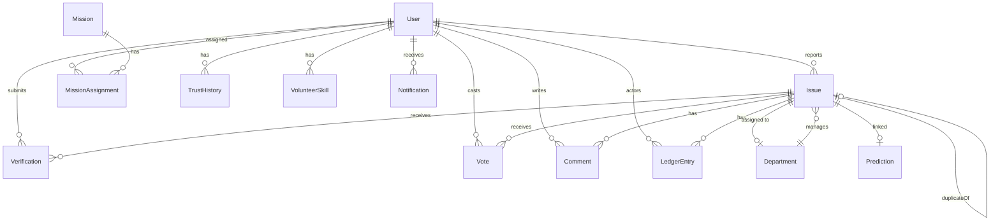

# Community Hero AI — Database Schema

## Entity Relationship Overview



## Tables

### User
| Column | Type | Description |
|---|---|---|
| id | UUID (PK) | Unique identifier |
| email | String (unique) | User email |
| name | String | Display name |
| avatar | String? | Profile image URL |
| role | Enum | CITIZEN / VOLUNTEER / AUTHORITY / ADMIN |
| trustScore | Float (50) | Trust score 0-100 |
| xp | Int (0) | Experience points |
| level | Int (1) | Current level 1-5 |
| ward | String? | Geographic ward |
| badges | Json | Array of earned badge IDs |
| googleId | String? | Google OAuth ID |
| passwordHash | String? | Bcrypt hash |
| isActive | Boolean | Account active |
| isBanned | Boolean | Account banned |
| deletedAt | DateTime? | Soft delete timestamp |
| createdAt | DateTime | Created timestamp |
| updatedAt | DateTime | Updated timestamp |

### Issue
| Column | Type | Description |
|---|---|---|
| id | UUID (PK) | Unique identifier |
| title | String | Issue title |
| description | String | Detailed description |
| category | Enum | POTHOLE/WATER_LEAKAGE/GARBAGE/STREETLIGHT/SEWAGE/INFRASTRUCTURE/OTHER |
| severity | Enum | LOW / MEDIUM / HIGH / CRITICAL |
| status | Enum | SUBMITTED → AI_VERIFIED → COMMUNITY_VERIFIED → ASSIGNED → IN_PROGRESS → RESOLVED → CLOSED |
| lat | Float | Latitude |
| lng | Float | Longitude |
| address | String | Human-readable address |
| ward | String? | Ward identifier |
| mediaUrls | Json | Array of media file URLs |
| aiAnalysis | Json? | Gemini AI analysis result |
| upvotes | Int (0) | Upvote count |
| downvotes | Int (0) | Downvote count |
| civicScore | Float? | Civic emergency score 0-100 |
| slaDeadline | DateTime? | SLA deadline |
| resolvedAt | DateTime? | Resolution timestamp |
| isFraudFlagged | Boolean | Flagged as suspicious |
| isDeleted | Boolean | Soft deleted |
| duplicateOfId | UUID? | Reference to original if duplicate |
| reportedById | UUID (FK) | Reporting user |
| assignedToId | UUID? (FK) | Assigned authority user |
| departmentId | UUID? (FK) | Assigned department |

### Verification
| Column | Type | Description |
|---|---|---|
| id | UUID (PK) | Unique identifier |
| issueId | UUID (FK) | Related issue |
| userId | UUID (FK) | Verifying user |
| result | Enum | EXISTS / FAKE / RESOLVED |
| trustWeight | Float | Voter's trust score at time of vote |
| notes | String? | Optional verification notes |
| createdAt | DateTime | Timestamp |

### LedgerEntry (Immutable)
| Column | Type | Description |
|---|---|---|
| id | UUID (PK) | Unique identifier |
| issueId | UUID (FK) | Related issue |
| action | String | Action type (e.g., "STATUS_CHANGED") |
| actorId | UUID (FK) | User performing action |
| actorName | String | Snapshot of actor name |
| metadata | Json | Additional context |
| createdAt | DateTime | Immutable timestamp |

### Prediction
| Column | Type | Description |
|---|---|---|
| id | UUID (PK) | Unique identifier |
| issueType | String | Predicted issue category |
| ward | String | Target ward |
| probability | Float | Probability 0-1 |
| reasoning | String | AI explanation |
| weatherContext | String? | Weather data used |
| generatedAt | DateTime | Generation timestamp |
| expiresAt | DateTime | Prediction validity end |
| issueId | UUID? | Linked issue if materialized |

### Department
| Column | Type | Description |
|---|---|---|
| id | UUID (PK) | Unique identifier |
| name | String | Department name |
| category | String | Issue category handled |
| slaCritical | Int (24) | SLA hours for CRITICAL |
| slaHigh | Int (72) | SLA hours for HIGH |
| slaMedium | Int (168) | SLA hours for MEDIUM (7 days) |
| slaLow | Int (720) | SLA hours for LOW (30 days) |

## Indexes

```sql
-- Geospatial lookup
CREATE INDEX idx_issue_location ON "Issue" (lat, lng);
CREATE INDEX idx_issue_ward ON "Issue" (ward);
CREATE INDEX idx_issue_status ON "Issue" (status);
CREATE INDEX idx_issue_category ON "Issue" (category);

-- User lookups
CREATE UNIQUE INDEX idx_user_email ON "User" (email);
CREATE INDEX idx_user_trust ON "User" (trustScore DESC);
CREATE INDEX idx_user_xp ON "User" (xp DESC);

-- Notifications
CREATE INDEX idx_notification_user ON "Notification" (userId, isRead);

-- Verifications
CREATE UNIQUE INDEX idx_verification_unique ON "Verification" (issueId, userId);

-- Ledger
CREATE INDEX idx_ledger_issue ON "LedgerEntry" (issueId, createdAt);
```
